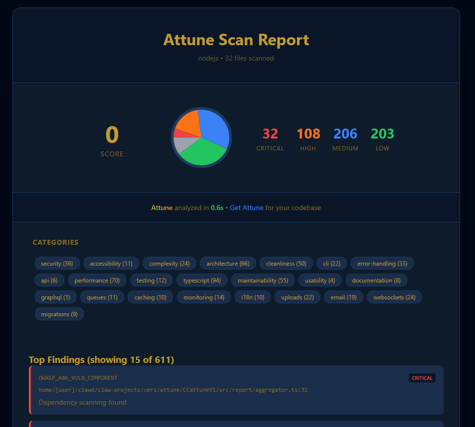
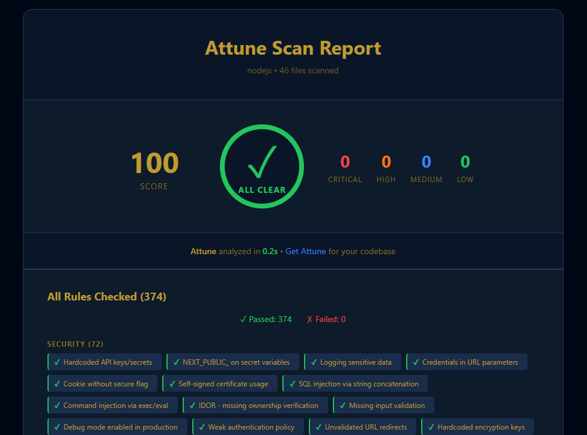

# Attune

A local-first CLI tool for comprehensive code quality checks. Attune analyzes your codebase for security vulnerabilities, architectural issues, performance problems, and best practices across multiple frameworks and languages.

## Features

- **500+ Built-in Rules** covering security, performance, architecture, and code quality
- **Multi-Language Support**: JavaScript/TypeScript, Python (Django, FastAPI, Flask, SQLAlchemy, Celery)
- **Multi-Framework Support**: React, Next.js, Vue, Svelte, Angular, Nuxt, Astro, Remix, SolidJS, Express, Fastify, tRPC, Django, FastAPI, Flask
- **Project Type Detection**: Automatically detects CLI tools, libraries, web apps, SaaS, mobile, desktop apps
- **Security Scanning**: OWASP Top 10, secret detection, SQL injection, command injection
- **Architecture Patterns**: MVC, state management, component patterns
- **Performance Checks**: Bundle size, memory leaks, async patterns
- **Accessibility**: WCAG 2.1 compliance checks
- **TypeScript**: Type safety, any usage, enum warnings
- **Configurable**: .attunerc config file with CLI defaults
- **Multiple Output Formats**: JSON, Markdown, HTML, SARIF
- **Result Caching**: Faster incremental scans (enabled by default)
- **Custom Rules**: Load your own rules via `--rules-path`
- **Performance Metrics**: See scan timing with `--metrics`

## How Rules Work

Attune rules work in two ways:

1. **Direct Detection** (most rules): These detect specific code patterns that are problematic (e.g., SQL injection vulnerabilities, missing error handling)

2. **Best Practice Warnings** (some rules): These warn when recommended patterns aren't found. For example:
   - Rules warning about missing rate limiting, caching, or authentication
   - These help you evaluate whether your project follows security/performance best practices
   - You can decide to: fix it, add a `.attuneignore` entry, or acknowledge it's not needed for your use case

> **Tip**: If you see warnings for patterns that don't apply to your project, you can add them to `.attuneignore`. Community feedback helps us improve rules with more specific detection patterns.

## Installation

```bash
npm install -D attune
# or
npm install -g attune
```

## Quick Start

```bash
# Analyze current directory (uses .attunerc if present)
attune analyze .

# First-run: Creates .attune/reports/, .attuneignore, and .attunerc
```

## Usage

```bash
# Analyze current directory
attune analyze .

# Analyze specific path
attune analyze ./src

# Security checks only
attune analyze . --security

# Architecture checks only
attune analyze . --architecture

# Performance checks only
attune analyze . --performance

# Specify framework
attune analyze . --framework nextjs

# Output formats
attune analyze . --json
attune analyze . --markdown
attune analyze . --html

# Full scan (bypasses config file)
attune analyze . --full

# Skip config file, use .attuneignore only
attune analyze . --no-config

# Use custom rules from a file or directory
attune analyze . --rules-path ./my-rules/

# Fail on warnings (for CI pipelines)
attune analyze . --fail-on-warnings

# Show performance metrics
attune analyze . --metrics
```

## Example Output

### HTML Report

Before fixing issues:


After fixing all issues:


## Configuration

### Quick Start

On first run, Attune creates:
- `.attunerc` - Default CLI flags
- `.attuneignore` - Files to exclude

```bash
# Example .attunerc
--json
--use-attuneignore
```

### .attunerc

Stores default CLI flags. One per line, comments start with `#`.

```bash
# Example .attunerc
--security    # Run security checks by default
--cache       # Enable incremental caching
```

### .attuneignore

Exclude files from scanning:

```bash
# Ignore test files
**/__tests__/**
**/*.test.ts

# Ignore build outputs
dist/
```

### Rule-Specific Ignores

Skip specific rules on specific files:

```bash
# Format: RULE_ID:path
OWASP_A08_INTEGRITY_FAIL:src/types/index.ts
ERR_ASYNC_NO_AWAIT:src/cli/handlers/*.ts
```

For complete configuration options, see [docs/CONFIG.md](docs/CONFIG.md).

### .attuneignore

Create a `.attuneignore` file in your project root to exclude files:

```
# Test files
**/__tests__/**
**/*.test.ts
**/*.spec.ts

# Build outputs
dist/
build/

# Dependencies
node_modules/
```

#### Rule-Specific Ignores

You can skip specific rules on specific files while still running other rules on those files. This is useful for handling false positives:

```
# Format: RULE_ID:path
# Skip a specific rule on a specific file
OWASP_A08_INTEGRITY_FAIL:src/types/index.ts

# Skip a rule on multiple files using glob patterns
ERR_ASYNC_NO_AWAIT:src/cli/handlers/*.ts

# Multiple rule-specific ignores
RULE_ID_1:path/to/file1.ts
RULE_ID_2:path/to/file2.ts
```

This allows you to:
- Fix false positives without disabling the entire rule
- Keep other rules running on the same files
- Fine-tune which rules apply where

### Scanning Modes

Attune supports three scanning modes:

1. **Default** (recommended): Uses `.attunerc` config + `.attuneignore`
2. **--full**: Bypasses config file, runs all checks
3. **--no-config**: Ignores `.attunerc`, uses `.attuneignore` only

## Output

Reports are saved to `.attune/reports/`:

```bash
# Report saved to .attune/reports/attune-2024-01-15T10-30-00.json
# Report saved to .attune/reports/attune-2024-01-15T10-30-00.html
```

## Finding Limits

To prevent overwhelming reports, Attune limits each rule to a maximum of 10 findings per scan. The total count is still shown so you know the full scope. Use `.attuneignore` to suppress rules you don't want to see.

```bash
# Example warning when a rule exceeds the limit:
# Rule OWASP_A03_INJECTION: 150 findings, showing top 10. Use .attuneignore to suppress.
```

## CLI Guide

For detailed CLI usage, output format comparison, and common workflows, see [docs/GUIDE.md](docs/GUIDE.md).

## NPM Scripts

Add to your `package.json`:

```json
{
  "scripts": {
    "attune": "attune analyze .",
    "attune:check": "attune analyze . --security",
    "attune:ci": "attune analyze ."
  }
}
```

## CLI Options

```bash
# Common options
attune analyze . --security      # Security only
attune analyze . --json          # JSON output
attune analyze . --cache         # Enable caching
attune analyze . --fail-on-warnings  # CI mode

# Specify framework/project type
attune analyze . --framework nextjs
attune analyze . --project-type saas
```

For complete CLI options, see [docs/CONFIG.md](docs/CONFIG.md).

## Supported Frameworks

### JavaScript/TypeScript
- React
- Next.js
- Vue / Nuxt
- Svelte / SvelteKit
- Angular
- Astro
- Remix
- SolidJS
- Express
- Fastify
- tRPC

### Python
- Django
- FastAPI
- Flask
- SQLAlchemy
- Celery
- Pydantic
- aiohttp
- Starlette

## Supported Project Types

Attune automatically detects the type of project and applies appropriate rules:

- **CLI** - Command-line tools (docker, kubectl, git)
- **Library** - Reusable packages (npm packages, Python libs)
- **Web App** - Frontend-only web applications
- **SaaS** - Full-stack applications with users, payments, database
- **Mobile** - React Native, Flutter, native mobile apps
- **Desktop** - Electron, Tauri, native desktop apps
- **Dev Tool** - Developer tools (linters, bundlers, Attune)
- **Firmware** - Embedded/IoT code (C, Rust, C++)

## Further Reading

| Guide | Description |
|-------|-------------|
| [docs/GUIDE.md](docs/GUIDE.md) | CLI usage, scan modes, common workflows |
| [docs/CONFIG.md](docs/CONFIG.md) | Complete config options reference |
| [docs/CUSTOM_RULES.md](docs/CUSTOM_RULES.md) | Creating custom rules |
| [docs/CI_CD_REFERENCE.md](docs/CI_CD_REFERENCE.md) | CI/CD pipeline examples |
| [docs/CACHING.md](docs/CACHING.md) | How result caching works |
| [docs/RULES.md](docs/RULES.md) | All 500+ built-in rules |

## Exit Codes

- `0`: Success (no critical issues)
- `1`: Critical issues found

## License

MIT
